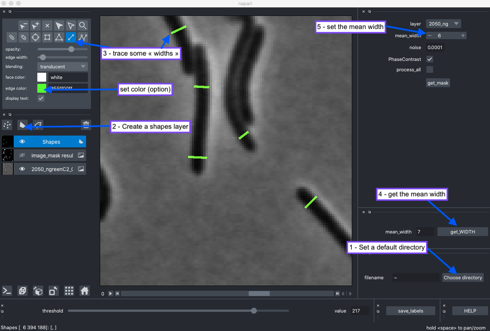

# MiSiCgui
A GUI for MiSiC tool

Based on MiSiC ("https://github.com/pswapnesh/MiSiC")

Please cite: ("https://www.biorxiv.org/content/10.1101/2020.10.07.328666v1")

## Installation
Requires version python version 3.7 install via [pip]:

we recommand to create a specific envronement with conda/miniconda, exemple:

`conda create --name MiSiCgui git python=3.7`

`conda activate MiSiCgui`

`pip install git+https://github.com/leec13/MiSiCgui.git`

`MISIC`

## Troubleshooting

Mac : 

Sometimes needs to install Xcode.

or at least the gcc compiler :

`conda install clang_osx-64`

`conda install -c anaconda psutil`

(not tested yet)

Linux :

Some linux systems need :

`conda install gcc_linux-64`

`sudo apt-get install --reinstall libxcb-xinerama0`

## Usage

### command line
type MISIC in the terminal:

```bash
$ MISIC
```

### How to use it
The Napari site explain how to use the interface, please see :

("https://napari.org/tutorials/")

Specific commands for MISICgui (respect the order)

1 - Drag and drop one images

2 - Select a default directory

Measure roughtly the mean width of cell (steps 2, 3, 4 in the screenshot bellow)

5 - Set the mean width with the upper right button

6 - click "get_mask" button

To process all slides of one stack slect "process all"

The screenshots bellow explain each step :




